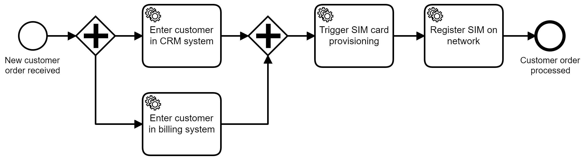

[](https://img.shields.io/badge/Compatible%20with-Camunda%20Platform%207-26d07c)

# Customer Onboarding Process

*Process solution example for customer onboarding as used in the OReilly book [Practical Process Automation](https://processautomationbook.com/).*



It uses Camunda Platform as process automation solution.

This simple onboarding process is meant to get started with process automation, workflow engines and BPMN.

# How to Run 

This repository contains fragments in different technologies and programming languages.

## Java And Spring Boot

There is a process solution, which is a Maven project, in `process-solution-java`.

It contains:

* The onboarding process model as BPMN
* Sample (pseudo) source code to enter the customer in the CRM and billing system

You can run this by

```
cd process-solution-java
mvn package exec:java
```

Then there is an [external task worker](https://docs.camunda.org/manual/latest/user-guide/process-engine/external-tasks/) in Java to trigger sim provisioning in `worker-java`.

Run it by

```
cd worker-java
mvn package exec:java
```

The worker to register the sim in the network is in NodeJs, see next section.

## NodeJs

One external task worker is in NodeJS to showcase technologies. You find it in `worker-nodejs`.

Run it by

```
cd worker-nodejs
npm update
node index.js
```


## C-Sharp

There are external task workers for entering cutomer data in the CRM and billing system available in `worker-csharp`. 
You can either start them additionally and see that now the C# and Java worker compete for external tasks.

But you might also just want to skip Java completly and start the C# application. Therefore:

1. Run the Camunda workflow engine, most probably using [Camunda Run]()
1. Open the process model in `onboarding-external-task-only.bpmn` with the [Camunda Modeler]() and deploy the model from there to your local Camunda engine
1. Start the C# application:

```
cd worker-csharp
dotnet run
```

# Play

You can easily use the application by requesting a new customer onboarding posting a PUT REST request to 

`curl -X PUT http://localhost:8080/customer?name=bernd`

You can now see the process instance in Camunda Cockpit: http://localhost:8080/camunda/app/cockpit/default/

You can work on the user task using Camunda Tasklist: http://localhost:8080/camunda/app/tasklist/default/

